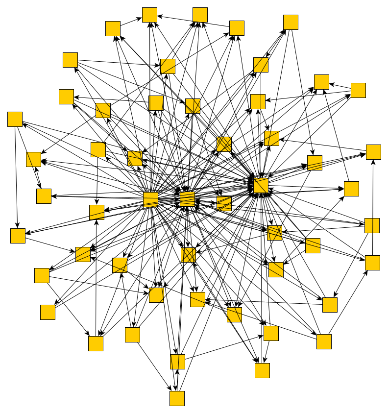

# Project Overview

This project streamlines the extraction and analysis of 3D data from STEP (.step or .stp) CAD files for a range of applications, including machine learning, data analytics, and industrial research. It automatically constructs various graph representations (e.g., assembly graphs and hierarchical graphs) showing part connectivity and topological relationships, generates metadata using OpenAI’s GPT-based services, and extracts part images for visualization.

By leveraging multi-core processing, this tool can efficiently handle large collections of STEP files in parallel. The integrated GPT-based metadata feature is especially helpful for those aiming to annotate or categorize 3D datasets. In addition, optional part- and assembly-level images can be generated to further enrich downstream workflows (e.g., visual verification or training image-based ML models), a capability that follows broader trends in combining image data and GPT models for structured information retrieval.

In essence, this pipeline consolidates geometry parsing, graph creation, image extraction, and GPT-driven metadata generation into one efficient process, producing outputs that can be saved as images, GraphML files, PDFs, HTML visualizations, and JSON metadata. This all-in-one approach makes it straightforward to integrate 3D STEP data into advanced analytics and AI-driven pipelines.

## Table of Contents

- [Features](#features)
- [Project Structure](#project-structure)
- [Installation](#installation)
- [Usage](#usage)
- [How It Works](#how-it-works)
- [Logging and Debugging](#logging-and-debugging)
- [Performance Considerations](#performance-considerations)
- [Possible Extensions](#possible-extensions)
- [Differences Between Graph Types](#differences-between-graph-types)

---

## Features

- **STEP Parsing and Geometry Extraction:** Reads 3D geometry from STEP files and identifies valid shapes.
- **Multi-process Execution:** Distributes processing across CPUs to handle large volumes of files.
- **Assembly Graph Generation:**  Builds a graph of part connectivity using geometrical checks via bounding boxes and 3D distance calculations.
- **Hierarchical Graph Generation** Explores the shape’s shell/face/edge hierarchy and generates a graph to illustrate the structure.
- **Image Extraction** Optionally produces screenshots (PNG) for each part and a full assembly using OCC’s display context.
- **Metadata Generation (OpenAI GPT integration)** Generates descriptive metadata, tags, or categories.
- **Logging & Resource Monitoring** Records logs to a file and monitors memory usage.
- **Flexible CLI Options** Control every aspect (e.g., concurrency level, whether to skip existing outputs, pdf/html output, etc.).

---

## Project Structure

```plaintext

├── dataset/ # Datasets
├── graphs/
│ └── assembly_graph.py # Creates the assembly graph using networkx. Checks which parts are connected using R-tree bounding box queries and fine-grained collision checks.
│ └── hierarchical_graph.py # Builds a hierarchical graph from topological elements (shells, faces, edges) using pythonocc-core’s TopExp_Explorer.
├── metadata/
│ └── metadata_generator.py # mplements optional metadata generation using OpenAI GPT. Takes either part names or a compressed grayscale snapshot of the overall assembly as inputs.
├── processing/
│ └── step_file.py # Manages the low-level reading of STEP files using pythonocc-core (STEPCAFControl_Reader). Collects part shapes and the main shape from the file.
│ └── step_file_processor.py # Core logic for reading, processing, and generating outputs for a single STEP file. Handles assembly and hierarchical graph building, image exports, saving results, and optional metadata generation.
├── utils/
│ └── logging_utils.py # Sets up logging and includes a function to log memory usage across all child processes.
│ └── shape_utils.py # Contains geometry-related helper functions for bounding boxes, checking connectivity between shapes, etc.
├── output/ # Saved models and recommendation outputs
├── main.py # Entry point for command-line usage. Parses CLI arguments and calls process_step_files().
├── workers.py # Manages parallel processing for STEP-file tasks. Contains worker_init() to set up logging and displays in subprocesses, as well as process_single_file() to process individual files.
└── requirements.txt # Python dependencies
```

## Installation

Follow these steps to set up the environment

### 1. Clone the Repository

    `git clone https://github.com/yourusername/step2graph.git`
    `cd step2graph`

### 2. Create a Conda Environment

Create a new Conda environment named `step2graph` (or any name of your choice):

`conda create -n step2graph python=3.12 -y`

Activate the environment:

`conda activate step2graph`

### 3. Install Python OCC

Install `pythonocc-core` to manage Jupyter notebooks:

`conda install -c conda-forge pythonocc-core=7.8.1.1`

### 4. Install Python Dependencies

    `pip install -r requirements.txt`

### 5. Set Your OpenAI API Key (OPTIONAL)

To generate metadata using OpenAI's GPT-4, you need to set the `OPENAI_API_KEY` environment variable. You can do this by running:

`export OPENAI_API_KEY="your-api-key-here"  # Linux/macOS`

`set OPENAI_API_KEY="your-api-key-here"     # Windows    `

### 6. Running in a Headless Environment (OPTIONAL)

If you intend to run this framework in a headless environment—such as a Docker container, a remote server, or a CI pipeline without a physical display—you must either configure a virtual screen (e.g., Xvfb) or set the `PYTHONOCC_OFFSCREEN_RENDERER` environment variable to "1" so that Open Cascade (pythonocc-core) can render images offscreen. However, even with these measures in place, hardware acceleration or driver dependencies may still cause problems.

#### Example:

1. **Setting an Environment Variable for Offscreen Rendering (PREFERRED)**

   `export PYTHONOCC_OFFSCREEN_RENDERER="1"`
2. **Using a Virtual Screen (Xvfb)**

- Install and launch Xvfb before running your script.
- Export DISPLAY to match the virtual screen’s display number.

If Open Cascade detects no display and `PYTHONOCC_OFFSCREEN_RENDERER` is not set, image extraction may fail or produce blank images. As stated above, you can work around this by using a virtual screen or enabling offscreen rendering through the environment variable.

## Usage

The program is run via the command line using main.py. Below are the main arguments:

### Command-Line Arguments

| Argument                  | Description                                                                        | Required | Default                     |
| ------------------------- | ---------------------------------------------------------------------------------- | -------- | --------------------------- |
| `--input`               | Path to the directory containing the STEP files to be processed.                   | Yes      | None                        |
| `--output`              | Path to the directory where output files will be saved.                            | Yes      | None                        |
| `--process-all`         | Whether to process all files, including those already processed.                   | No       | False                       |
| `--processes`           | Number of parallel processes to use.                                               | No       | Half of available CPU cores |
| `--max-performance`     | Use all available CPU cores for maximum performance.                               | No       | False                       |
| `--generate-metadata`   | Generate metadata using OpenAI GPT.                                                | No       | False                       |
| `--log`                 | Enable logging to a file.                                                          | No       | False                       |
| `--assembly`            | Generate assembly graph.                                                           | No       | False                       |
| `--save-pdf`            | Save assembly graph as a PDF (requires `--assembly`).                            | No       | False                       |
| `--save-html`           | Save assembly graph as an interactive HTML (requires `--assembly`).              | No       | False                       |
| `--hierarchical`        | Generate hierarchical graph.                                                       | No       | False                       |
| `--no-self-connections` | Removes edges in the assembly graph that link a node to itself (i.e., self-loops). | No       | False                       |
| `--stats`               | Generate statistics for STEP files.                                                | No       | False                       |
| `--images`              | Save images of parts in the assembly graph.                                        | No       | False                       |
| `--only-full-assembly`  | Only save full assembly image.                                                     | No       | False                       |

#### Example:

`python main.py --input /path/to/step/files --output /path/to/output --generate-metadata --assembly --save-pdf --processes 4 `

This will process the STEP files in the specified input folder, generate metadata, create an assembly graph, and save the graph as a PDF using 4 cores of the CPU.

## How It Works

### Main Workflow

* main.py reads command-line (CLI) arguments (e.g., --assembly, --hierarchical) and prepares logging if enabled.
* The script gathers all STEP files from your input folder, creating a list of tasks (one per file).
* A ProcessPoolExecutor dispatches these tasks to available worker processes in parallel, ensuring efficient use of CPU resources.
* Each worker executes process_single_file() to parse the STEP file, build assembly or hierarchical graphs, optionally generate images, and produce metadata.
* Once complete, results (e.g., GraphML files, PDFs, images) are saved to the designated output folder.

### Parallel Processing

* This project leverages Python’s ProcessPoolExecutor to perform parallel processing, distributing STEP-file workloads across multiple CPU cores. Parallel processing allows you to handle multiple data streams concurrently, reducing the overall runtime.
* At startup, worker_init() configures logging and (if requested) initializes a lightweight open Open Cascade display context for generating part images.
* Each process independently loads the STEP file, creates graphs or metadata, and writes results back to disk. This concurrent step-by-step workflow helps ensure that long-running operations like geometry checks or GPT API calls do not block the entire pipeline.
* By default, half the available CPU cores are used, though you can specify --max-performance to harness all cores when needed. This setup aligns with best practices for maximizing throughput on CPU-intensive tasks if system responsiveness is not a priority.

### Reading STEP Files

This project uses pythonocc-core’s STEP control modules, along with XCAFDoc for handling assemblies, to load and store the geometry. A key step is reading the file into a TDocStd_Document and identifying whether each label (i.e., node in the XCAF document tree) represents a top-level assembly, a sub-assembly, or a single shape. The approach is as follows:

* A STEPCAFControl_Reader is pointed at the file. If parsing and data transfer to the TDocStd_Document succeed, a shape tool (XCAFDoc_DocumentTool.ShapeTool) is used to query all free shapes.
* For each free shape (root assembly), the code recurses through sub-assemblies or references, collecting geometry at each step and applying any accumulated transformations (e.g., from a part’s placement in the assembly).
* Simple shapes (non-assembly labels) are extracted and transformed with BRepBuilderAPI_Transform. Each distinct shape is then stored in a dictionary-like structure that maps geometry to a descriptive string name. If a shape is unlabeled, an “unnamed_x” placeholder is automatically generated.
* Finally, the tool reorders these parts by name and stores them in a list for downstream processing (e.g., graph construction). The main_shape is captured from the first free shape, which typically represents the highest-level CAD assembly in the STEP file.

### Assembly Graph Creation

In this framework, the **assembly graph** captures the part-to-part connectivity within a STEP file’s overall assembly. Each node in the graph represents a distinct part, and edges indicate that two parts are in contact (or sufficiently close) within the 3D space. The steps below outline the process—particularly highlighting the role of an R-tree structure in accelerating connectivity checks:

1. **Bounding Box Calculation**
   For each valid part, the bounding box is calculated using Open Cascade’s geometry utilities. These bounding boxes define the approximate spatial “footprint” of each part.
2. **R-tree Index Construction**
   All part bounding boxes are inserted into an R-tree for spatial indexing. An R-tree is a height-balanced data structure optimized for spatial queries, such as overlap or nearest-neighbor searches.
   * **Why R-trees?**
     * **Performance** : Instead of comparing every bounding box against every other (which is O(N2)O(N^2)**O**(**N**2**)**), an R-tree typically offers near-logarithmic search for overlap queries (O(Nlog⁡N)O(N \log N)**O**(**N**log**N**) under average conditions). This dramatically speeds up the process of finding candidates for geometric contact.
     * **Spatial Organization** : R-trees group bounding boxes hierarchically, which is well-suited for large assemblies with many parts.
   * **Downsides** :
   * **Tree Construction Overhead** : Building and maintaining the R-tree has an upfront cost, which may be non-trivial if the parts are few or the distribution is highly skewed.
   * **Worst-case Degradation** : If many bounding boxes are large or heavily overlapping, query performance can degrade and approach naive O(N2)O(N^2)**O**(**N**2**)** checks.
   * **Extra Complexity** : Implementing and tuning R-tree parameters introduces complexity compared to a straightforward pairwise bounding-box check.
3. **Initial Overlap Detection**
   Once the R-tree is built, each part queries the structure with an *expanded* bounding box (enlarged by a tolerance factor, often derived from the bounding box diagonal). This step quickly identifies other parts that might overlap within that tolerance. By doing so, the framework narrows down the pool of potential colliding parts from the entire set to a much smaller subset.
4. **Precise Geometric Checks**
   For each candidate overlap from the R-tree query, a more precise distance check between the two shapes is performed (e.g., using `BRepExtrema_DistShapeShape`). If the minimum distance between the shapes is below a defined threshold, the algorithm considers them to be in contact and adds an undirected edge in the assembly graph.
5. **Results**
   After iterating through all parts, the resulting undirected graph reflects the actual connectivity between the components. Nodes represent individual parts, and edges are created only where physical contact (or near-contact) is confirmed. The framework offers several export formats (e.g., GraphML, PDF, HTML) for downstream analysis or visualization.

By leveraging R-trees, the assembly graph creation step remains efficient even for large assemblies with hundreds or thousands of parts. Despite some potential downsides—such as tree-build overhead or worst-case performance if bounding boxes are highly overlapping—R-trees greatly reduce the burden of exhaustive collision checks, making them a practical choice for this framework’s geometry-driven workflow.

<div style="text-align: center;">
    
  </div>

### Hierarchical Graph Creation

The **hierarchical graph** details the internal topological structure of a 3D shape—capturing its decomposition into shells, faces, and edges. This is accomplished by systematically traversing each shape (using tools like `TopExp_Explorer` in `pythonocc-core`) and mapping topological elements into a directed or layered graph.

1. **Topological Decomposition**

   * For a given shape, the **shells** represent the outer boundary (or multiple boundaries if there are internal cavities).
   * Each shell is composed of one or more  **faces** , each face typically corresponding to a continuous surface.
   * Faces are bounded by  **edges** , which in turn are bounded by vertices.
   * The hierarchical graph thus emerges from this natural layering:
     **Shell**→**Face**→**Edge**
2. **Graph Construction Flow**

   * **Shell Discovery** : Identify all the shells in the shape (often just one outer shell, though complex parts may contain internal ones).
   * **Face Enumeration** : For each shell, enumerate the faces that form its boundary.
   * **Edge Extraction** : Break down the faces into their constituent edges and record the relationships in a networkx (or similar) graph.
   * **Directed or Layered Representation** :
     * In many use cases, edges are directed from the shell to its faces, and from faces to their edges, reflecting a parent–child hierarchy.
     * Alternatively, a layered graph structure may be used for clarity in visualizations or downstream data processing.
3. **Key Benefits**

   * **Granular Feature Recognition** : By dissecting shapes down to the face or edge level, researchers can identify critical features (holes, fillets, pockets, etc.) more precisely than a purely assembly-level analysis.
   * **Enhanced Analytics & AI** : Machine learning or data-driven pipelines can mine detailed geometric/topological features (e.g., face curvature, edge adjacency) to classify parts, predict manufacturability, or optimize designs.
   * **Interoperability & Standards** : This hierarchical representation aligns with standard CAD data models (STEP/ISO 10303). Each topological element (shell, face, edge) can be mapped back to high-level geometric entities or specific production notes.
   * **Customization for Downstream Tasks** : Depending on the research or industrial goal—finite element analysis (FEA), computational geometry, dimensional verification—this hierarchy can serve as a robust data structure. Tasks like meshing, boundary condition assignment, or region-based segmentations can directly leverage the graph nodes and edges.
4. **Use Cases**

   * **Feature-based Cost Estimation** : Identify faces associated with machining operations (e.g., holes, pockets) to estimate manufacturing cost or runtime.
   * **3D Model Classification** : ML classifiers can use graph-based descriptors (number of faces, edge curvature distributions, adjacency patterns) to detect common part types or features.
   * **Design Optimization** : Engineers can pinpoint which faces or edges contribute most to weight, stress concentration, or other performance criteria.
   * **Academic Research** : Hierarchical data structures are crucial in shape analysis, topological indexing, or multi-scale geometry retrieval, fostering novel algorithms in geometry processing.
5. **Export & Visualization**

   * Similar to the assembly graph, the hierarchical graph is typically saved as a **GraphML** (or equivalent) file, enabling easy import into visualization tools and network analysis libraries.
   * Researchers or engineers can then visualize shells, faces, and edges as layered node groups.
   * This structured breakdown offers a clear path toward *in-depth geometry insights* that are otherwise hard to glean from purely assembly-level or bounding-box–based analyses.

By representing each shape’s topology in a hierarchical graph, the framework delivers **finer-grained** insights into the geometry’s fundamental building blocks. As 3D model data proliferates in manufacturing, simulation, and academic research, this approach provides a **scalable, standards-aligned** method for advanced shape understanding, classification, and optimization.

<div style="text-align: center;">
    
  </div>

### Differences Between Graph Types

1. Assembly Graph:

* Purpose: Focuses on how top-level parts within an assembly relate to each other geometrically.
* Method: Uses bounding boxes, an R-tree, and proximity checks to detect if two parts are touching or are close enough to be considered connected.
* Structure: Undirected graph; each node is a part, and each edge represents connectivity.

2. Hierarchical Graph:

* Purpose: Illustrates the internal topological structure of a single 3D shape: shells, faces, and edges.
* Method: Traverses the shape’s topology (e.g., using TopExp_Explorer) to break down the shape into sub-elements.
* Structure: Typically a directed or layered graph (shell → face → edge). This reveals the shape’s internal composition rather than its connections to other shapes.

In essence, the assembly graph operates at the “assembly” or multi-part level. Meanwhile, the hierarchical graph works at the finer “within-part” level of topology. Together, these two graphs offer a complete view of both how parts come together (assembly) and how each part itself is structured (hierarchy).

### Image Extraction and Display Manager

This project can optionally generate visual snapshots (PNG) of both individual parts and the full assembly. This feature relies on Open Cascade’s display context (via pythonocc-core) and is orchestrated by a custom Display Manager.

#### 1. Display Manager Singleton

A special class, DisplayManager, ensures only one display context is initialized per worker process:

* When the worker process starts, worker_init() calls DisplayManager.initialize() if the user requested images.
* DisplayManager uses init_display() internally to set up a small 320×240 window for rendering and snapshots.
* Subsequent calls to DisplayManager.get_display() in that process return the same shared display context rather than creating multiple windows.

#### 2. Single-Process Rendering Flow

Inside each process:

* The code obtains the display context from DisplayManager.get_display().
* Before rendering each shape, any previously rendered objects are cleared.
* The shape is added to the display context as an AIS_Shape, the view is fitted to show the entire geometry, and then the view is “dumped” to a PNG file.
* Once the snapshot is saved, the AIS_Shape is removed from the display context to free resources.

#### 3. Extracting Part Images vs. Full Assembly

In extract_images(), each part shape is rendered individually (unless --only-full-assembly was specified). If a shape is valid, the display pipeline is:

* Remove any previously displayed geometry with RemoveAll()
* Display the current part as an AIS_Shape.
* FitAll() to center it on the screen.
* Dump() the result to a PNG file.
* Check for completion (i.e., that the PNG file actually exists and is non-empty).

After all parts are processed, one final “full assembly” snapshot is rendered using the combined shape. This image is saved under the name `<filename>`_full_assembly.png.

#### 4. Concurrency and Memory Management

Because each worker process may render multiple files:

* The memory usage is monitored and logged after each file is processed.
* DisplayManager.clear_display() is called at the end of each processed file, removing all shapes from the display context.
* This helps keep resource usage in check, particularly when handling large batches of STEP files or high-volume parallel processing.

In practice, this approach allows multiple processes to generate snapshots simultaneously without conflicting over a single shared display resource. Each process has its own display context, ensuring that concurrency issues (like locked GUIs or race conditions in rendering) are minimized.

When run with the --images flag:

* The code automatically includes image extraction in the pipeline, generating part-level and assembly-level PNGs in the specified output folder.
* If --only-full-assembly is specified, only the final assembly snapshot is created.

As a result, you gain a quick visual reference for each part and the overall assembly, which can be especially useful for manual inspection or automated QA checks.

### Metadata Generation

The framework uses OpenAI's GPT model to generate descriptive metadata about assemblies in two ways:

1.**Part Name Analysis**

**Note**: Not every STEP file includes meaningful part names. In some cases, part names may be too generic or not useful, which can affect the quality of the generated metadata.

- Analyzes component names from STEP file
- Generates structured metadata including:

  - Brief description
  - Up to 2 relevant categories
  - Complexity estimate (low/medium/high)
  - Industry/application
  - Simplified component names

2.**Image Analysis (Fallback)**

- Uses if part names unavailable/insufficient
- Processes assembly screenshots:

  - Converts to grayscale
  - Compresses for efficiency
- Generates same metadata structure

The metadata is saved as JSON and can be used for:

- Assembly classification
- Search/filtering
- Complexity assessment
- Industry categorization

### Methodology

The metadata generation process involves creating a prompt for OpenAI's GPT model to analyze either the part names or images of the assembly. The prompt is designed to extract relevant information and structure it into a JSON format. The prompt includes instructions to generate a brief description, potential categories, complexity estimate, industry application, and simplified component names.

### Limitations

While the metadata generation process is powerful, it has some limitations:

* **Generic Naming**: The model can sometimes generate overly generic names for parts, such as "manufacturing part," which may not be very informative.
* **Hallucination**: The model may occasionally hallucinate, generating metadata that is not accurate or relevant to the actual assembly.

## Logging and Debugging

* If --log is specified, logs are written to “processing_log.txt” in the output folder.
* logging_utils.py provides setup_logging() and log_process_memory() to monitor total memory usage across the main and worker processes.
* For debugging concurrency issues, examine the logs for any exceptions reported during worker tasks.

## Performance Considerations

* By default, the project uses half of the CPU cores. Use --max-performance if you need maximum speed and can tolerate heavy CPU usage.
* The script tries to batch files based on available memory (in process_step_files_optimized). Large files or complicated geometry may require limiting the number of parallel processes.
* Storing images can be memory-intensive. Use --only-full-assembly if you don't need images of all the parts.
